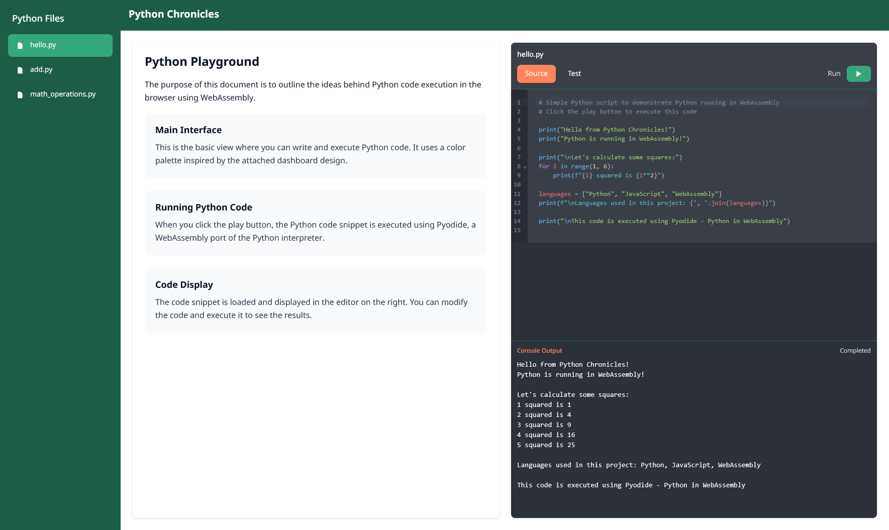

# Python Chronicles

[](https://github.com/achudars/python-chronicles/actions/workflows/python-tests.yml)
[](https://github.com/achudars/python-chronicles/actions/workflows/ci-cd.yml)
[](https://github.com/achudars/python-chronicles/actions/workflows/cross-platform-tests.yml)

Run Python code directly in your browser using WebAssembly.



## Features

- Execute Python code in the browser using Pyodide (WebAssembly)
- Code syntax highlighting with CodeMirror
- Dynamic file discovery - automatically loads all Python files from the project
- Switch between source code and test files
- View execution output in real-time
- Responsive design with accessibility features
- Comprehensive error handling and user feedback

## Tech Stack

- Next.js with TypeScript
- Tailwind CSS for styling
- Pyodide for Python execution in WebAssembly
- CodeMirror for the code editor

## Getting Started

1. Install dependencies:

   ```bash
   npm install
   ```

2. Start the development server:

   ```bash
   npm run dev
   ```

3. Open [http://localhost:3000](http://localhost:3000) in your browser.

## Testing

### Python Tests

The project includes comprehensive Python tests that run automatically on every push:

```bash
# Run all Python tests
cd public/python
python tests/run_all_tests.py
```

### Individual Test Files

- `test_hello.py` - Tests for hello.py module
- `test_add.py` - Tests for add.py module
- `test_math_operations.py` - Tests for math_operations.py module

### Continuous Integration

The project uses comprehensive GitHub Actions workflows for quality assurance:

- ✅ **Python Tests**: Automated testing on Python 3.12 with pytest
  - Runs all unit tests in the `public/python/tests/` directory
  - Ensures code functionality and reliability
- ✅ **CI/CD Pipeline**: Full build and deployment pipeline

  - Node.js dependency installation and caching
  - Next.js application build verification
  - ESLint code quality checks
  - TypeScript type checking

- ✅ **Cross-Platform Tests**: Multi-environment compatibility

  - Tests on Ubuntu, Windows, and macOS
  - Ensures cross-platform functionality
  - Python 3.12 compatibility verification

- ✅ **Security & Dependency Checks**: Automated security scanning
  - npm audit for JavaScript dependencies
  - Dependency vulnerability scanning
  - Security best practices enforcement

All workflows must pass before code can be merged, ensuring high code quality and reliability.

## How It Works

1. The application automatically discovers and loads all Python files from `public/python/src/`
2. Users can select any Python file from the dynamic sidebar navigation
3. Switch between source code and corresponding test files
4. Pyodide (WebAssembly Python runtime) is initialized in the browser
5. When you click the run button, the selected code is executed using Pyodide
6. Output is captured and displayed in the console area with proper error handling
7. The interface provides accessibility features and responsive design for all devices

## Adding New Python Files

To add a new Python file to the application:

1. Create your Python file in `public/python/src/`
2. Optionally create a corresponding test file in `public/python/tests/` with the prefix `test_`
3. The file will automatically appear in the sidebar navigation
4. No code changes required - the application dynamically discovers new files!
